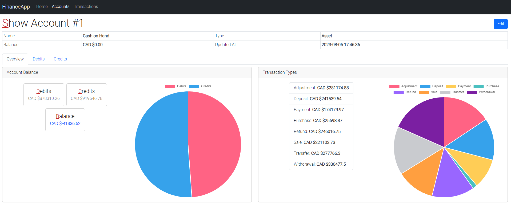

# FinanceApp

[](https://opensource.org/licenses/MIT)

FinanceApp is a user-friendly financial management application that streamlines your transactions and accounts.

Easily track your expenses, income, and savings in one place, allowing you to make informed financial decisions with confidence.



## Requirements

- PHP 7.3 or higher
- Composer
- Node.js 14.21 or higher
- NPM

## Installation

1. Clone the repository:

`git clone https://github.com/shakkurcwb/FinanceApp`

2. Navigate to the project directory:

`cd FinanceApp`

3. Install PHP dependencies using Composer:

`composer install`

4. Install JavaScript dependencies using npm:

`npm i`

## Configuration

1. Create a copy of the .env.example file and rename it to .env:

`cp .env.example .env`

2. Generate an application key:

`php artisan key:generate`

3. Configure your database settings in the .env file:

```
DB_CONNECTION=mysql
DB_HOST=127.0.0.1
DB_PORT=3306
DB_DATABASE=your_database_name
DB_USERNAME=your_database_username
DB_PASSWORD=your_database_password
```

For SQLite, simply create a file called `database.sqlite` under `database` folder:

```
DB_CONNECTION=sqlite
```

## Database Migration

Run the database migrations to create the necessary tables:

`php artisan migrate` or `php artisan migrate:fresh`

## Database Data Seeding

Feel free to update the initial dataset in `database/seeders/DatabaseSeeder.php`.

`php artisan migrate --seed`

## Building JavaScript Assets

To build the JavaScript assets using Laravel Mix, run the following command:

`npm run dev` or `npm run production`

## Usage

Start the development server:

`php artisan serve`

Access the application by visiting: http://localhost:8000

## License

This project is licensed under the MIT License - see the [LICENSE](LICENSE) file for details.